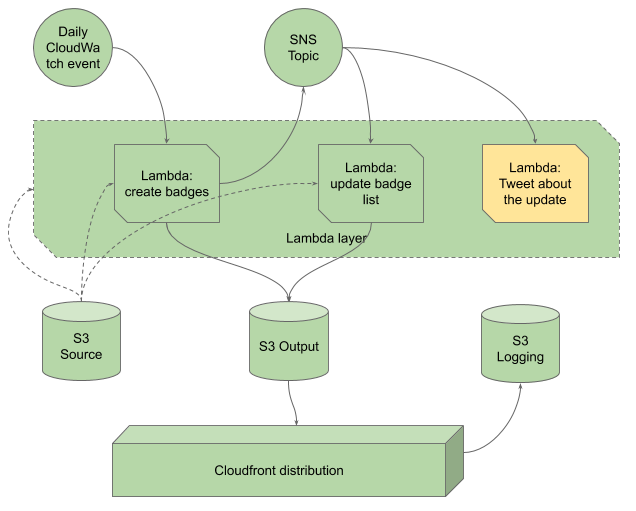

# Development

[back to the index](./)

## Infrastructure

Everything deployed to AWS using Terraform scripts.

## Flow



- *green* is implemented and deployed
- *yellow* is planned

## Requirements

1. python 3.6 with pipenv
2. an AWS IAM profile named `dv-co2ppmbadge` (or rename what defined in [terraform.tfvars](../infrastructure/terraform.tfvars)) with credentials stored in `~/.aws`
3. install dependencies, as follows:

```bash
pipenv install --dev
```

## Test

this will run unit tests and reports on code coverage

```bash
make test
make coveralls
```

## Deploy

create infrastructure

```bash
make build_zips
make tf_init
make tf_plan
make tf_apply
```

## Destroy

delete infrastructure

```bash
make tf_destroy
```
